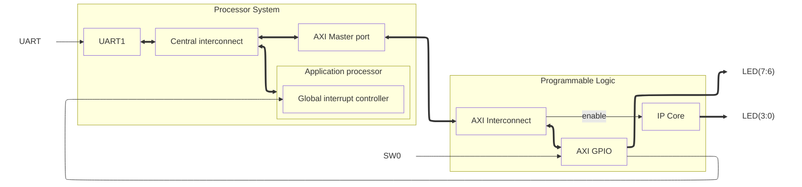

# Xilinx Project Template

This is a template for Xilinx projects. It includes a simple Verilog module and a testbench.

## Usage

Create project for the first time:

```bash
vivado -mode batch  -source ./scripts/create_project.tcl -nolog -nojournal
```

Simulate:

```bash
iverilog -o ./sim/testbench.vvp ./sim/testbench.v
```

```bash
vvp ./sim/testbench.vvp
```

```bash
iverilog -o ./sim/testbench.vcd ./sim/testbench.v
```

```bash
gtkwave ./sim/testbench.vcd
```

Generate bitstream:

```bash
vivado -mode batch -source ./scripts/write_bitstream.tcl -nolog -nojournal
```

Program FPGA:

```bash
vivado -mode batch -source ./scripts/program_fpga.tcl -nolog -nojournal
```

## Toolset

- [Vivado 2024.2](https://www.xilinx.com/support/download/index.html/content/xilinx/en/downloadNav/vivado-design-tools/2024-2.html) for synthesis, implementation and bitstream generation
- [Icarus Verilog 12.0](http://iverilog.icarus.com/) for RTL simulation
- [GTKWave 3.3.100](http://gtkwave.sourceforge.net/) for viewing waveforms
- [Pytest](https://docs.pytest.org/en/6.2.x/) for testing
- [Matplotlib](https://matplotlib.org/) for plotting tesst results

## Developer Notes

- [ ] Use VSCode templates for test files.
- [ ] Investigate how to perform timing analysis with tcl scripts.
- [ ] Investigate how to perform power analysis with tcl scripts.
- [ ] Investigate how to perform area analysis with tcl scripts.

## Arquitecture

